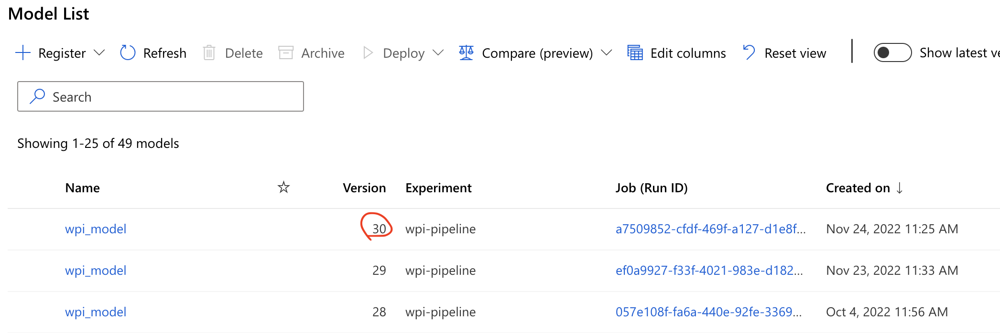

# About the project

This repository contains code to score social welfare applications on the extent to which they require further investigation, and, by extension, which team should handle the application. The project was done by team Advanced Analytics for Werk, Participatie & Inkomen (WPI). Further documentation besides this `Readme` is available at team Advanced Analytics or WPI.


# Changelog

### 1.0.0
* First released version of the model to use in the pilot.


# Installation

#### 1. Clone the code

```bash
git clone git@ssh.dev.azure.com:v3/CloudCompetenceCenter/Datateam-Sociaal/wpi-onderzoekswaardigheid-aanvraag
```

#### 2. Install Poetry
If you don't have it yet, follow the instructions [here](https://python-poetry.org/docs/#installation) to install the package manager Poetry.

#### 3. Generate Personal Access Token (PAT) 
The project uses several custom packages ([Bias Collection](https://CloudCompetenceCenter@dev.azure.com/CloudCompetenceCenter/Datateam-Sociaal/_git/team-aa-bias-collection), [AMLA toolkit](https://dev.azure.com/CloudCompetenceCenter/Datateam-Sociaal/_git/team-aa-amla-toolkit), [Fraude Preventie Pakket](https://CloudCompetenceCenter@dev.azure.com/CloudCompetenceCenter/Datateam-Sociaal/_git/team-aa-fraude-preventie-pakket)) that we must enable Poetry to download. To do so, first generate a PAT by go to `dev.azure.com` > User settings > Personal Access Tokens. Create a PAT with scope `Packaging (Read)`. Make sure to save it somewhere, because you won't be able to retrieve it again after closing the screen.

:warning: If your PAT ever gets compromised, make sure to invalidate it and create a new one.

#### 4. Configure Poetry to authenticate to Azure DevOps Artifacts

:warning: The username actually doesn't matter, only the PAT is used.

```bash
poetry config http-basic.gemeente USERNAME PERSONAL_ACCESS_TOKEN
```

#### 5. Verify contents of `auth.toml`

The previous step should've written the credentials to a file `auth.toml`, but due to a problem with Poetry, it's possible that the PAT doesn't get written. Therefore, we should check that `auth.toml` is complete. On Mac, the path is likely `~/Library/Application Support/pypoetry/auth.toml` and on Linux `/root/.config/pypoetry/auth.toml`. Run `poetry config -vvv` to see the exact location of the file. 

Open it (on Mac you should do this through Finder, else the file somehow appears empty) and check if all the details are there. It should look something like this:
```
[http-basic]
[http-basic.gemeente]
username = "USERNAME"
password = "PERSONAL_ACCESS_TOKEN"
```

If the password/PAT is missing, add that line manually.

#### 6. Install dependencies
In the terminal, navigate to the project root (the folder containing `pyproject.toml`), then use Poetry to create a new virtual environment and install the dependencies.

```bash
cd wpi-onderzoekswaardigheid-aanvraag
poetry install
```
    
#### 7. Install pre-commit hooks
The pre-commit hooks help to ensure that all committed code is valid and consistently formatted.

```bash
poetry run pre-commit install
```


#### 8. Configure stripping of notebook outputs
Configure Git to strip the output of Jupyter notebooks when committing. This helps to prevent accidentally committing sensitive information to the repo - but note that ultimately this is still your responsibility, so pay attention to what you commit.
    
 ```bash
 git config filter.jupyter.clean nbstripout
 git config filter.jupyter.smudge cat
 ```


# Configuration

The model was originally developed on the Veilige Analyse Omgeving (VAO), but the project is now set up to run on Azure Machine Learning - the Analyse Services environment of the gemeente, to be precise.

The project is configured using a combination of files:
- Project development config file, `dev-config.yml`, located in the project root. This file does not contain secrets and is therefore checked into version control.
- Project production config file, `production-config.yml`, located in the project root. This file does not contain secrets and is therefore checked into version control.
- AML config file, `aml-config.yml`, located in the project root. This file contains secret information. Only an example `aml-config.example.yml` is therefore checked in to version control that you should copy and rename, filling it with your own details.
- Other `yml` files located in `wpi_onderzoekswaardigheid_aanvraag.model.classifier`.

### Dev config

The `dev-config.yml` configures the model and preprocessing pipeline regarding:
- Data sources
- Caching
- Logging
- Model
- Flags
- Sensitive features (for bias analysis)
- Reweigh features (for reweighing dataset)
- API

Most options are self-explanatory or explained in comments in the config file. The two tables below contain additional explanation for the configuration of the **model** and the **flags**.

| Setting | Meaning |
|---|---|
| **Model** |
| `algorithm` | Type of algorithm to train. Options: `RF` for random forest, `XGB` for gradient boosting, `EBM` for explainable boosting machine. |
| `handling_types` | List of types of applications to include in the dataset. Each string should match a boolean column in the dataframe indicating if the application was of that type. Used to distinguish between applications handled by handhaving or inkomen. |
| `core_product_numbers` | The product numbers for which the model will be scoring applications. Used to filter the dataset and certain features. | 
| `feature_selection` | Options: <br>`all_features`: Train on all features available in `wpi_onderzoekswaardigheid_aanvraag.model.classifier.all_features.yml`. <br> `selected_features`: Train on previously selected features as given in `wpi_onderzoekswaardigheid_aanvraag.model.classifier.selected_features.yml` <br> `cut_fimp`: First train on all features, then cut all features above a given cumulative feature importance threshold (see `fimp_threshold`). <br> `forward_feature_selection`: Apply forward feature selection to select the best features. | 
| `fimp_threshold` | Threshold between 0 and 1 on cumulative feature importance, above which features will be cut if using `cut_fimp` as feature selection method. |
| `register_model` | If true, register the model on Azure Machine Learning after training. |

| Setting | Meaning |
|---|---|
| **Flags** |
| `NONE` | Required in case none of the other flags are active. |
| `DEVELOPMENT_MODE` | If active, reduce size of the dataset for quicker iteration during development. |
| `GRIDSEARCH` | If active, perform gridsearch over parameters from `wpi_onderzoekswaardigheid_aanvraag.model.classifier.parameter_grids.yml`, else use hardcoded parameters from `wpi_onderzoekswaardigheid_aanvraag.model.classifier.parameters.yml`. |
| `SAVE_PARAMS` | If active, save parameters of the (best) model to `wpi_onderzoekswaardigheid_aanvraag.model.classifier.parameters.yml` and final list of features to `wpi_onderzoekswaardigheid_aanvraag.model.classifier.selected_features.yml`. |
| `BIAS` | If active, calculate bias metrics after training the model, using the group specification from the `sensitive_features` entry in the project config.
| `REWEIGH` | If active, perform reweighing when training the model, using the `reweigh_features` entry in the project config. |

### Production config

The `production-config.yml` configures the model and preprocessing pipeline regarding:
- Data sources
- Caching
- Logging
- Model
- API

Most options are self-explanatory or explained in comments in the dev-config file section.

### AML config

The `aml-config.yml` configures the project in terms of the Azure connection (such as subscription ID and resource group) and the experiment details (such as compute name and environment name).


### YML files

The separate `yml` files in `wpi_onderzoekswaardigheid_aanvraag.model.classifier` configure various things, and also provide an overview of the last settings of the model.

| File | Content |
|---|---|
| `all_features.yml` | Features to consider for training the model. Note that this may be different from what's actually used depending on the feature selection method you set. |
| `selected_features.yml` | Set of selected features from the last time the model was trained with `SAVE_PARAMS` flag active. |
| `parameter_grids.yml` | Parameter grids to do gridsearch over if the corresponding flag is turned on. |
| `parameters.yml` | Parameters to use when not doing gridsearch. Note that this file gets written automatically when training the model with the `SAVE_PARAMS` flag turned on. |


# Development

For development, the package is designed to run on Azure ML. `wpi_onderzoekswaardigheid_aanvraag.entrypoints` contains several entrypoint files that allow you to do all the very cool things this package can do. The most important one for you as a user/developer is `submit_pipeline_experiment.py`, which submits a job to AML to run the following entrypoints consecutively in an AML pipeline:

1. `train_preprocessing_pipeline.py`: Can be used to train and save the preprocessing pipeline, which fetches data from a source and creates the necessary features from it. The pipeline and the transformed data will be pickled and saved for re-use if nothing changes.
2. `train_model.py`: Can be used to train and save the model, along with some basic model statistics.
3. `model_stats.py`: Can be used to generate a markdown file with the basic statistics of a trained model.

The last entrypoint, `score_applications.py` helps to quickly score some applications.

For more information on the development process and choices made, please refer to the technical documentation.


# Deployment 

For deployment, the model is packaged into an API. The main ingredients are:

| File | Content |
|---|---|
| `Dockerfile` | Dockerfile to build the container with the model API. |
| `wpi_onderzoekswaardigheid_aanvraag.api.api.py` | API to serve score requests of new applications. |
| `wpi_onderzoekswaardigheid_aanvraag.scorer.py` | Scorer class that wraps around the model to create predictions and explanation. |

An Azure DevOps pipeline is set up to:
1. Download the trained model artifact(s) from our Azure ML environment.
2. Test the package.
3. Build the Docker image and push it to the container registry.
4. Refresh the deployment of the API on Azure App Services.

For more information on the infrastructure, please refer to the 'Architectuurnotitie'.

### Releasing a new model version

To release a new version of the model, it's important to closely follow the steps below, so that we comply with regulation regarding traceability of data, code and models.

1. Checkout the desired version of the code and train the model on AzureML.

2. Note the version number of the newly registered model:

    

    We refer to this as the **AML version number**. It will only be used to download the right model from AzureML.

3. In the `pyproject.toml`, look up the current version number under `[tool.poetry]` > `version`. We refer to this as the **project version number**. It will be used to administer which model version was deployed.

4. Create a release branch for the new version, branching out from `dev`: 
    ```bash
    git checkout dev
    git checkout -b release/x.y.z
    ```
    replacing `x.y.z` with the new project version number. You can obtain this by incrementing the version you found in step 3, taking into account the following:

    :warning: We loosely try to use [semantic versioning](https://semver.org/), *except* for the major version. For governance purposes, the major version must be related to the input dataset used to train the model, which is archived in the AzureML storage account. 
    
    Example: Models trained on input dataset 1.0.0 should have version numbers in the form of `1.x.x`. Models trained on input dataset 2.0.0 should have version numbers in the form of `2.x.x`. And so on.

    Features and breaking changes are done by incrementing the second number: `1.x.0`. Bug fixes are done by incrementing the third number: `1.0.x`. 

5. On the release branch, change the project version number in the `pyproject.toml`, so that it matches the branch name.

6. Still on the release branch, change the default value of the parameter `AMLModelVersion` in the ADO pipeline that builds and deploys the model (`ci-cd/main.yml`). Set it to the AML version number you noted in step 2.

7. Update this Readme where necessary, especially the `Changelog` section.

8. Commit all changes:

    ```bash
    git add pyproject.toml README.md ci-cd/main.yml
    git commit -m "Bump version to x.y.z"
    git push
    ```

    Ideally, those three should be the only files you changed, but if not, add the other files too. 
    
    :warning: If you made any changes to the model code, you may have to retrain the model and start again from step 1.

    Then tag the commit with the version number:
    ```bash
    git tag x.y.z
    git push origin x.y.z
    ```
    
    Your changes will be deployed automatically to the `test` environment when you commit. Verify that everything is working and only continue to the next step if so.

9. Create a PR from the release branch to `dev`. Do **not** remove the release branch when merging the PR yet. 

    Your changes will be deployed automatically to the `acc` environment when the PR is merged. Verify that everything is working and only continue to the next step if so.

    If it's not working, revert the merge and temporarily redeploy the previous version to prevent downtime on the `acc` environment while you fix things.

10. Create a PR from the release branch to `master`. Your changes will be deployed automatically to the `prd` environment when the PR is merged. Note that the last step of the pipeline (the deployment) will require approval from a group of people (the POs of AA or DASO). Also note that at the end of the pipeline, it's going to try to archive the model, for which you'll have to manually enter a login code - see the pipeline output. Verify that everything is working. If not, you're allowed to panic for a short while, then better get to work solving the issue ;-)

11. Finally, verify:
    - That the release commit was tagged with the project version number `x.y.z`.
    - That the deployment pipeline successfully archived the deployed model in the storage account belonging to the AzureML environment of Advanced Analytics (`aaodataweupq6n7hrbqbokeqz`). The model should be archived under `archive/models/x.y.z`. 
    - That the major version number of the model corresponds to the major version number of the input dataset that the model was trained on.

Congratulations on a successful release!

### Running Docker with API locally for debugging

Note that it's also possible to run the Docker container with the API locally for debugging purposes. To do so, make sure you have the required files `model.pkl` and `pipeline.pkl` in a location as shown:
```
parent_folder
│
└───wpi-onderzoekswaardigheid-aanvraag [= the cloned repository folder]
│   │   ...
│   │
│   └───wpi-onderzoekswaardigheid_aanvraag
│       │   ...
│   
└───model_artifacts/wpi_model/outputs [create this folder manually]
    │
    └───wpi_model.pkl
    │
    └───pipeline/pipeline.pkl
```

Then, from the `parent_folder`, run:
```bash
docker build . --tag wpi-model:latest --build-arg POETRY_HTTP_BASIC_GEMEENTE_PASSWORD_arg=YOUR_PERSONAL_ACCESS_TOKEN --build-arg AML_MODEL_ID_arg=my_awesome_model:1 --build-arg PROJECT_VERSION_arg=0.0.0 -f wpi-onderzoekswaardigheid-aanvraag/Dockerfile

docker run -p 8000:8000 -e pw_daso_api=TOKEN_TO_AUTHENTICATE_TO_DASO_API -e api_auth_token=TOKEN_TO_AUTHENTICATE_TO_OUR_API -e DATA_API_URL=URL_OF_DASO_API -e AI_INSTRUMENTATIONKEY=INSTRUMENTATION_KEY -e KEY_VAULT_NAME=bogus wpi-model
```
Don't forget to replace `YOUR_PERSONAL_ACCESS_TOKEN`, `TOKEN_TO_AUTHENTICATE_TO_DASO_API`, `URL_OF_DASO_API`, and `INSTRUMENTATION_KEY` with the corresponding values and set any value you wish for `TOKEN_TO_AUTHENTICATE_TO_OUR_API`.

You can then connect to the local API at `0.0.0.0:8000` using the token you set.

# Other notes

### Expectations on data

Besides tests to ensure the code is working correct, this project also makes use of the [Great Expectations](https://greatexpectations.io/) package to check some basic expectations on the output of the pipeline. The JSON-file with expectations is in the `resources` folder. It can be edited either directly or by making use of the notebook `analysis.edit_expectations.ipynb`.

